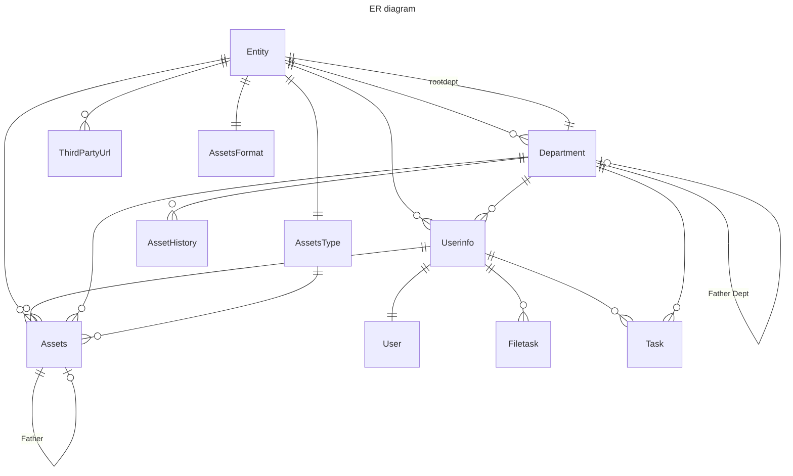

# 数据库表单

对于 Foreign Key, 在属性栏目标记了其 CASCADE 属性。不可以 CASCADE 对应 `MODELS.PROTECT`, CASCADE 对应了 `MODELS>CASCADE`，手动判定则说明在执行删除操作前需要手动判定这一类型的外链可否被删除。

每一张表单下面还有一张对应的 Linked By 表，表示 *自身被哪些其他表单中的外链所链接* 。这一信息和上述内容是一一对应了，同时记录了自身修改/删除的时候，相应链接到自己的表项是否需要执行相关操作。一个例子是：

> Asset 链接到了 Userinfo 上；当 Userinfo 的 department 信息修改的时候，需要把所有相应 Asset 的 department 信息也一同修改。两者应该一直保持一致。

## User

Django 自带，部分数据段未启用。

使用这一模型的目的是使用自带的完善的加密算法，增加安全性。

| 字段     | 类型 | 属性                                | 说明                                       |
| -------- | ---- | ----------------------------------- | ------------------------------------------ |
| id       | INT  | Primary Key, Unique, Auto Increment | 没有启用                                   |
| username | CHAR | Unique, max_length=191              | 需要手动判定 Unique,  max_length 尚未配置? |

<strong>Linked By</strong>

| 表单     | 别名     | 属性          | 修改 | 删除     |
| -------- | -------- | ------------- | ---- | -------- |
| Userinfo | userinfo | OneToOneField | /    | 手动判定 |

---

## Userinfo

*用户信息，与用户一一对应*

【存在 OneToOneField，禁止删除自身】

| 字段           | 类型                    | 属性                                | 说明                             |
| -------------- | ----------------------- | ----------------------------------- | -------------------------------- |
| id             | INT                     | Primary Key, Unique, Auto Increment | 默认，未使用                     |
| user           | OneToOneField(User)     | 【手动判定】                        |                                  |
| entity         | FOREIGN_KEY(Entity)     | null = True，【不可以CASCADE】      |                                  |
| department     | FOREIGN_KEY(Department) | null = True，【不可以CASCADE】      |                                  |
| super_admin    | BOOL                    | default = False                     |                                  |
| entity_admin   | BOOL                    | default = False                     |                                  |
| property_admin | BOOL                    | default = False                     |                                  |
| valid          | BOOL                    | default = True                      |                                  |
| name           | Unique, max_length=191  |                                     | 与相应 user 的 username 字段相同 |
| feishu_token   | CHAR                    | unique = True                       |                                  |
| feishu_id      | CHAR                    | unique = True                       |                                  |

<strong>Linked By</strong>

| 表单     | 别名           | 属性       | 修改                                                    | 删除          |
| -------- | -------------- | ---------- | ------------------------------------------------------- | ------------- |
| Assets   | Assets         | ForeignKey | 若修改用户 department，需要更改相应 assets 信息         | 不允许CASCADE |
| FileTask | filetask       | ForeignKey | /                                                       | CASCADE       |
| Task     | task_applicant | ForeignKey | 若修改用户 department，【将未审批的工单自动设置为失败】 | CASCADE       |

---

## Entity

*实体信息*

| 字段 | 类型 | 属性                                | 说明                     |
| ---- | ---- | ----------------------------------- | ------------------------ |
| id   | INT  | Primary Key, Unique, Auto Increment | 唯一 id， 启用，不可修改 |
| name | CHAR | Unique, max_length=100              | 需要手动判定 Unique      |

<strong>Linked By</strong>

| 表单          | 别名       | 属性          | 修改 | 删除                       |
| ------------- | ---------- | ------------- | ---- | -------------------------- |
| Userinfo      | userinfo   | ForeignKey    | /    | 不可以CASCADE              |
| Department    | department | ForeignKey    | /    | CASCADE                    |
| Department    | root_dept  | OneToOneField | /    | （在上一步判断中已经涵盖） |
| ThirdPartyUrl | /          | ForeignKey    | /    | CASCADE                    |
| AssetsFormat  | format     | OneToOneField | /    | CASCADE                    |
| Assets        | assets     | ForeignKey    | /    | CASCADE                    |
| AssetsType    |            | ForeignKey    | /    | CASCADE                    |

如果一个实体仍然有使用中的资产，那么其一定有用户，则无法被删除。

---

## Department

*部门信息*

【如果 entity_father 非空，禁止删除自身】

| 字段          | 类型                   | 属性                                                  | 说明                           |
| ------------- | ---------------------- | ----------------------------------------------------- | ------------------------------ |
| id            | INT                    | Primary Key, Unique, Auto Increment                   | 唯一 id, 启用，不可修改        |
| name          | Char                   | Unique, max_length=100                                | 需要手动判定 Unique            |
| entity        | FOREIGN_KEY(Entity)    | 【手动判定】                                          | 不可以修改                     |
| is_root       | BOOL                   | default=False                                         | 是否是根部门（与实体一一对应） |
| entity_father | OneToOneField(Entity)  | null=True，【手动判定】                               | 如果是根部门，需要记录其实体   |
| father        | FORIGN_KEY(Department) | null=True，【手动判定】【父亲节点不能是自身或者sons】 | 父部门                         |

<strong>Linked By</strong>

| 表单         | 别名        | 属性       | 修改                       | 删除          |
| ------------ | ----------- | ---------- | -------------------------- | ------------- |
| Userinfo     | userinfo    | ForeignKey | /                          | 不可以CASCADE |
| Department   | sons        | ForeignKey | 父亲节点不能是自身或者sons | 手动判定      |
| Assets       | assets      | ForeignKey |                            | 不可以CASCADE |
| AssetHistory | history     | ForeignKey | /                          | CASCADE       |
| Task         | task_entity | ForeignKey | /                          | CASCADE       |

---

## ThirdPartyUrl

*第三方链接*

| 字段        | 类型                | 属性                                | 说明                    |
| ----------- | ------------------- | ----------------------------------- | ----------------------- |
| id          | INT                 | Primary Key, Unique, Auto Increment | 唯一 id, 启用，不可修改 |
| name        | Char                | max_length=1000                     | 名称                    |
| entity      | FOREIGN_KEY(Entity) | 【CASCADE】                         | 对应实体                |
| url         | Char                | max_length=1000                     | 链接                    |
| img_url     | Char                | max_length=1000                     | 图片链接                |
| description | Char                | max_length=1000                     | 描述                    |

---

## AssetsType(MPTTModel)

*资产类别信息*

| 字段   | 类型                     | 属性                                | 说明                           |
| ------ | ------------------------ | ----------------------------------- | ------------------------------ |
| id     | INT                      | Primary Key, Unique, Auto Increment | 唯一 id, 启用，不可修改        |
| name   | Char                     | max_length=100                      | 名称，需要手动判定同Entity 下 Unique |
| entity | TREE_FOREIGN_KEY(Entity) | 【手动判定】                          | 实体，不可修改 |
| is_root| BOOL                     | default=true                        | 是否是根类别 |
| parent | FOREIGN_KEY(AssetsType )  | null=True【手动判定？】                  | 父类别 |
|        |                          |                                     |                                |

<strong>Linked By</strong>

| 表单   | 别名   | 修改 | 属性        |
| ------ | ------ | ---- | ----------- |
| Assets | Assets | /    | Foreign_Key |

## AssetsFormat

*实体的资产相关格式信息，包括资产标签格式和自定义属性*

【不可删除自身】

| 字段   | 类型                     | 属性                                | 说明                           |
| ------ | ------------------------ | ----------------------------------- | ------------------------------ |
| entity | FOREIGN_KEY(Entity)      | 【CASCADE】null=false                | 与entity一一对应                |
| attrs  | BINARY                   |                                     | 用pickle直接dump                |
| type_color | CHAR | max_length=10 | |
| type_size | INT | default=20 | |
| type_enable | BOOL | default=true | |
| user_color | CHAR | max_length=10 | |
| user_size | INT | default=20 | |
| user_enable | BOOL | default=true | |
| entity_color | CHAR | max_length=10 | |
| entity_size | INT | default=20 | |
| entity_enable | BOOL | default=true | |

## Assets

*资产*

| 字段   | 类型                     | 属性                                | 说明                           |
| ------ | ------------------------ | ----------------------------------- | ------------------------------ |
| id | INT |  | 唯一性编号 |
| name | CHAR | | 名称 |
| type | FOREIGN_Key(AssetsType) | 【不可以CASCADE】 | 类别 |
| attrs| BINARY | | 自定义属性，用pickle 直接dump，使用时需要检查，符合 entity 的 attr 格式 |
| user | FOREIGN_KEY(UserInfo) | 【不可以CASCADE】 | 挂靠人(用户或管理员) |
| entity | FOREIGN_KEY(Entity) | 【不可以CASCADE】 | 实体，预期不会更改 |
| dept | FOREIGN_KEY(Department) | 【不可以CASCADE】 | 部门，需要保证和 user 项一致 |
| info | CHAR | | 基本资料【富文本】 |
| position | CHAR | | 位置 |
| brand | CHAR | | 品牌 |
| model | CHAR | | 型号 |
| serial | CHAR | | 序列号 |
| state | INT | | 状态【未领用、已领用、维保、清退】 |
| num | INT | | 数量 |
| created_time | CHAR | | 录入日期，按照django 默认格式 |
|lifespan|INT||使用期限|
| price | DECIMAL | | 原值 |
| net_value | DECIMAL | | 净值 |
| depreciation | FLOAT | | 折旧，百分比$0\leq $ depreciation $\leq 1$ |
| financial | Char | | 更多财务信息 |
| parent | FOREIGN_Key(Assets) | null=True, 【不可以CASCADE】 |  |
| history | CHAR | null=True | 历史信息 |
| picture | CHAR | null=True | 图片信息，可能直接pickle打包list? |
| maintain | Foreign_Key(Userinfo) | null=True，【不可以CASCADE】 | 维保状态下存储原用户信息 |

<strong>Linked By</strong>

| 表单       | 别名     | 属性       | 修改                         | 删除          |
| ---------- | -------- | ---------- | ---------------------------- | ------------- |
| Assets | sons  | ForeignKey | 由用户自己保证合法性 | 不可以CASCADE    |

## AssetHistory

*部门的资产统计信息*

| 字段   | 类型                     | 属性                                | 说明                           |
| ------ | ------------------------ | ----------------------------------- | ------------------------------ |
| department | FOREIGN_KEY(Department) | 【CASCADE】null=false                | 对应部门 |
| create_time | DateTimeFIeld |  | 统计时间 |
| value | DecimalField |  | 总价值 |

## FileTask

*异步任务（文件上传下载任务）*

| 字段        | 类型                  | 属性              | 说明                                                    |
| ----------- | --------------------- | ----------------- | ------------------------------------------------------- |
| task_type   | Integer               |                   | 1 - 导入资产；2 - 导出日志                              |
| create_time | DateTimeFIeld         |                   | 任务提出时间                                            |
| user        | FOREIGN_KEY(UserInfo) | 【CASCADE】       | 提出任务的用户                                          |
| state       | Integer               |                   | 任务状态，0: created, 1: processing, 2: success, 3:fail |
| detail      | CHAR                  | max_length = 1000 | 执行结果简要信息                                        |
| link        | CHAR                  |                   | 执行结果完整信息的链接                                  |
| filedir     | CHAR                  |                   | 执行任务对应文件位置                                    |

## Task

*用户工单*

| 字段       | 类型                     | 属性        | 说明                                                         |
| ---------- | ------------------------ | ----------- | ------------------------------------------------------------ |
| task_type  | Integer                  |             | 1- 资产领用；2 - 资产退库； 3 - 资产维保； 4 - 资产转移； 5 - 维保结束 |
| department | FOREIGN_KEY(Departmenrt) | 【CASCADE】 | 所属部门                                                     |
| applicant  | FOREIGN_KEY(UserInfo)    | 【CASCADE】 | 提出申请的用户                                               |
| content    | BinaryField              |             | pickle 存储任务详细信息                                      |
| status     | Integer                  |             | 任务状态 0 - 未审批；1 - 成功；2 失败                        |

