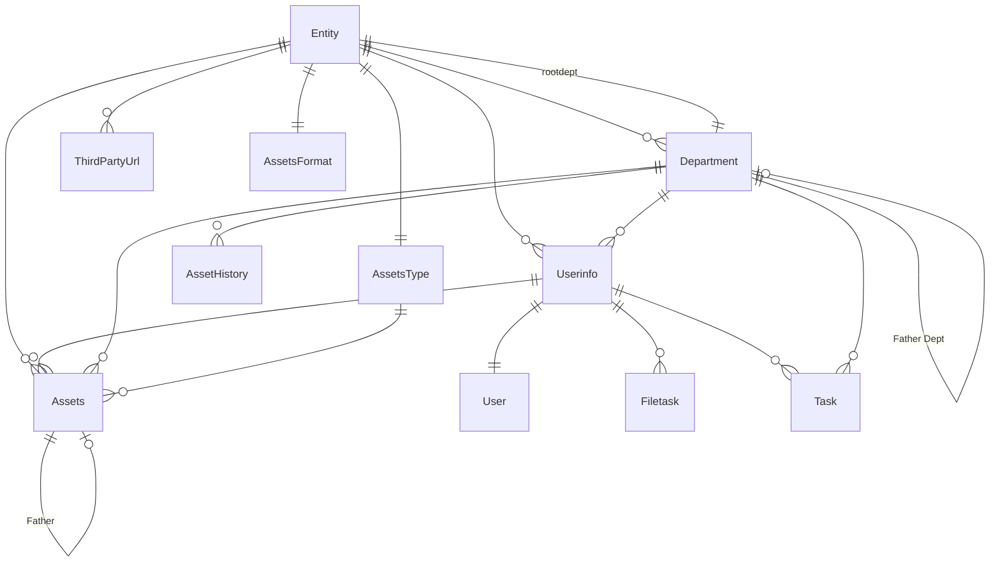

```mermaid
erDiagram
	Entity ||--o{ Userinfo: ""
    Entity || --o{ Department: ""
    Entity ||--|| Department: "rootdept"
    Entity || --o{ ThirdPartyUrl: ""
    Entity || --o{ Assets: ""
    Entity || -- || AssetsFormat :""
    Entity || -- || AssetsType :""
    Userinfo ||--|| User : ""
    Userinfo ||--o{ Assets: ""
    Userinfo ||--o{ Filetask: ""
    Userinfo ||--o{ Task: ""
    Department ||--o{ Userinfo:""
    Department ||--o| Department: "Father Dept"
    Department ||--o{ Assets:""
    Department ||--o{ AssetHistory:""
    Department ||--o{ Task:""
    AssetsType ||--o{ Assets:""
    Assets ||--o| Assets:"Father"
```
