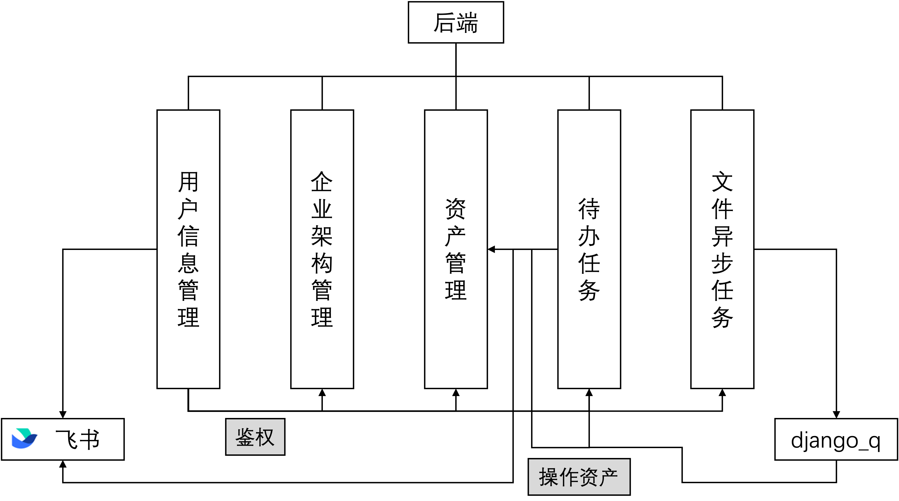

# 后端模块设计
后端整体使用 Django 作为基本框架设计，使用 django_q 辅助执行定时任务和异步任务，使用 mptt 辅助执行数据请求分页等功能。后端可以解耦为五部分：`user`, `organization`, `assets`, `task`, `filetask`，分别负责用户信息管理、企业架构管理、资产管理、待办任务以及文件异步任务。下面将对每部分的功能进行介绍。

|名称|中文名称|主要功能|
|---|---|---|
|user|用户信息管理|储存管理用户信息、鉴权|
|organization|企业架构管理|储存管理实体、部门关系|
|assets|资产管理|储存管理资产、资产类别、资产标签|
|task|待办任务|管理用户待办任务的创建和审批|
|filetask|文件异步任务|异步地处理批量导入和导出|

## `user` 用户信息管理

在此模块中，我们共使用了两个模型，分别为 django 自带的`django.contrib.auth.models.User`（后简称`User`）以及我们自行创建的`UserInfo`。

`User`中储存了用户的`id`和`密码`，使用 django 自带的密码功能实现对用户编号与密码的对应管理和加密。`UserInfo`中储存了用户的详细信息，例如用户名、实体、部门等信息。

此部分负责了用户注册、登入登出、管理员对用户信息进行变更以及飞书绑定、飞书登录的功能。除此之外，其他模块中的鉴权部分由此部分完成，具体方法为查询`UserInfo`中记录的权限信息。

## `organization` 企业架构管理

此模块中，共实现了三个模型，分别为`Entity`, `Organization`，分别记录了实体编号、名称，部门编号、名称、父部门等信息；`ThirdPartyUrl`，记录了与第三方url应用相关的信息，例如绑定部门、url、图片链接等。

`Entity`模型负责了实体的创建、编辑、删除以及获取实体信息；`Organization`模型负责了部门的创建、编辑、删除以及获取不同格式的部门信息。`ThirdPartyUrl`中的每条数据与`Entity`一一对应，负责了第三方应用的配置、修改等功能。

此部分负责维护系统中实体和部门的架构关系，以及与实体绑定的第三方应用。

## `assets` 资产管理

这是最核心的部分之一，负责管理系统中的资产，由四个模型构成：`Assets`, `AssetsType`, `AssetsFormat`, `AssetHistory`。它们分别负责管理资产信息、资产类别定义、资产格式定义以及储存资产变动的历史。

`Assets`模型负责了资产的增加、删除、查询、信息修改、状态变更、所有人变更、维保、提供扫描信息等功能；`AssetsType`负责资产类别定义，使用树状结构存储资产类别，负责资产类别的添加、删除和资产类别树的展示；`AssetsFormat`中的数据与`Entity`一一对应，用于储存不同资产定义的资产标签格式；`AssetHistory`负责历史展示、数据统计等功能。

除此之外，使用 django_q 创建和发起定时任务，负责资产定时折旧。此部分负责维护与资产相关的全部功能。

## `task` 待办任务

这也是最核心的部分之一，负责管理用户发起的待办任务。此部分由模型`Task`构成，定义了5种审批单，负责处理审批单的发起、审批、同意/拒绝、删除等。

除此之外，此部分还负责了飞书审批同步功能。当一个审批单被发起，此模块会自动地向飞书API发起一个请求，将审批单同步到飞书客户端并设置回调API。当飞书上的同意/拒绝被点击时，通过请求回调API与此模块联动，在后端处理审批单。

## `filetask` 文件异步任务

此部分负责处理批量导入等文件异步任务，由一个模型`FileTask`构成。

当用户请求批量导入任务列表、请求批量导入或批量导出日志时，此部分会完成相应操作。

此部分使用`django_q.tasks.async_task`异步地处理任务，提升性能。

## 后端模块模式图

